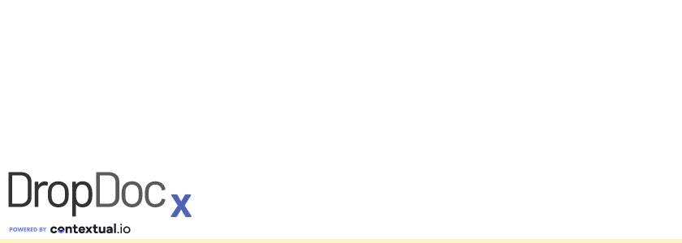

  
# Corporate Documentation  

## Getting Started 
1. [Welcome](../../docs/corp/01.getting.started/01.welcome.md)

## Training
1. [Basic Developer Training Course](../corp/02.training/basic.developer.training.course/)

## Components & Data  
1. [Object Types](../corp/03.components.data)
   1. [Data In Contextual](../corp/03.components.data/01.object.types)
      1. [Secrets](../corp/03.components.data/01.object.types/01.data.in.contextual/01.secrets.md)
      2. [Validation](../corp/03.components.data/01.object.types/01.data.in.contextual/02.validation.md)
      3. [Versioning](../corp/03.components.data/01.object.types/01.data.in.contextual/03.versioning.md)
1. [Flows](#)
1. [Agents](#)
1. [Connections](#)
1. [AI Routes](#)
6. [JWKS Profiles](#)

## Patterns
1. [Solution Architecture](#)  
1. [Working With Data](#)  
1. [Industry Cookbooks](#)  

## Tenants
1. [Tenant Workspace](#)  
1. [Tenant Logs](#)  
   1. [Contextual Log Query Language (CLQL)](#)
      1. [String Searches](#)
      2. [Keyword Searches](#)
      3. [Advanced Operators](#)
1. [Monitoring](#)  
1. [Tenant API](#)  